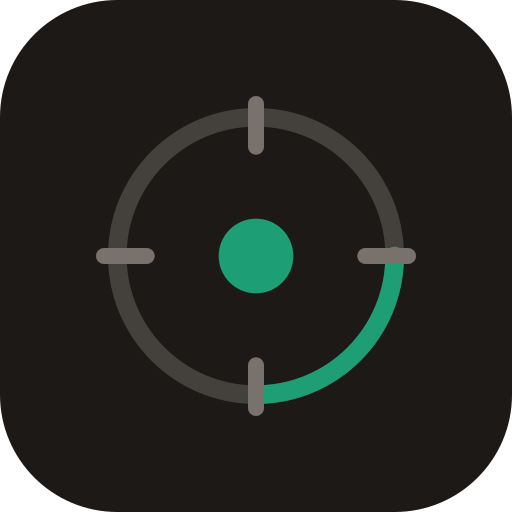

<div align="center">
  <br />
  
  <h1>Forca</h1>
  <p>
    <strong>Your calendar knows when you're free.<br />Forca makes sure you actually use that time.</strong>
  </p>
  <br />

[](https://github.com/3iiik/Forca/actions)
[](LICENSE)
[](https://github.com/3iiik/Forca/releases)
[](https://github.com/3iiik/Forca/releases)

  <br />
</div>

---

Forca is a productivity app that blocks distractions and automatically enables focus mode when your meetings end. It runs in the background, detects when you're free, and starts blocking distracting websites and applications so you can focus on what matters.

**How it works:**

1. Install the Forca desktop app and the browser extension.
2. Forca runs in the system tray and monitors your calendar (optional).
3. When a focus zone activates (automatically after a meeting or manually), the desktop app tells the browser extension which sites to block.
4. The extension uses Chrome's declarativeNetRequest API or Firefox's blocking API to prevent access to those sites.
5. When the focus zone ends, blocking stops automatically.

No account required. No data leaves your machine unless you enable multi-device sync.

---

## Features

| Feature | Description |
|---------|-------------|
| **Automatic Focus Activation** | Forca detects when meetings end via calendar integration and starts focus zones automatically |
| **Browser Extension** | Blocks distracting websites during focus sessions via WebSocket sync with the desktop app |
| **App Blocking** | Blocks distracting desktop applications during focus sessions |
| **Focus Zones** | Named focus sessions with configurable timers, triggers, and settings |
| **Zone Profiles** | Save and switch between presets with blocked apps/sites, timer duration, and ambient sound settings |
| **Calendar Integration** | Connect Google Calendar or any iCal feed for meeting-based triggers |
| **Ambient Focus Modes** | Rain, white noise, and forest sounds via Web Audio API |
| **Focus Score** | Daily, weekly, and monthly productivity scoring with charts |
| **Break Reminders** | Pomodoro-style break timer (50-minute focus / 10-minute break by default) |
| **Do Not Disturb Sync** | Automatically enable DND on macOS and Windows during focus sessions |
| **System Tray** | Colored tray icons, quick controls, and notifications |
| **Multi-Device Sync** | Firebase-powered sync across computers (optional) |
| **Focus Streaks** | Consecutive day tracking with milestone rewards |
| **Auto-Updater** | Seamless updates delivered via GitHub Releases |

---

## Supported Platforms

| Platform | Desktop App | Browser Extension |
|----------|-------------|-------------------|
| Windows (x64) | Installer (.exe) + Portable (.exe) | Firefox / Chromium |
| macOS (Intel) | DMG + ZIP | Firefox / Chromium |
| macOS (Apple Silicon) | DMG + ZIP | Firefox / Chromium |
| Linux (x64) | AppImage / .deb / .rpm | Firefox / Chromium |

---

## Download

### Desktop App

Download the latest release from [GitHub Releases](https://github.com/3iiik/Forca/releases/latest):

| Platform | Format | Link |
|----------|--------|------|
| Windows | Installer | [Forca-Setup-x64.exe](https://github.com/3iiik/Forca/releases/latest/download/Forca-Setup-x64.exe) |
| Windows | Portable | [Forca-Portable-x64.exe](https://github.com/3iiik/Forca/releases/latest/download/Forca-Portable-x64.exe) |
| macOS (Intel) | DMG | [Forca-x64.dmg](https://github.com/3iiik/Forca/releases/latest/download/Forca-x64.dmg) |
| macOS (Apple Silicon) | DMG | [Forca-arm64.dmg](https://github.com/3iiik/Forca/releases/latest/download/Forca-arm64.dmg) |
| Linux | AppImage | [Forca-x64.AppImage](https://github.com/3iiik/Forca/releases/latest/download/Forca-x64.AppImage) |
| Linux | Debian | [forca_amd64.deb](https://github.com/3iiik/Forca/releases/latest/download/forca_amd64.deb) |
| Linux | RPM | [forca-x86_64.rpm](https://github.com/3iiik/Forca/releases/latest/download/forca-x86_64.rpm) |

> On Windows, run Forca as Administrator for website blocking to work correctly.

### Browser Extension

#### Firefox / Waterfox / LibreWolf

Install directly from Firefox Add-ons:

**[Install Forca on Firefox](https://addons.mozilla.org/en-US/firefox/addon/forca-focus-mode-blocker/)**

The extension installs automatically through the add-ons store.

#### Chrome / Edge / Brave / Other Chromium Browsers

The Forca Chromium extension is **not currently published on the Chrome Web Store**. You can install it manually using Developer Mode:

1. Download the latest [Forca release](https://github.com/3iiik/Forca/releases/latest) and extract the ZIP, **or** clone this repository and use the `browser-extension/chrome-release/` folder directly.
2. Open your browser's extensions page:
   - **Chrome:** `chrome://extensions`
   - **Edge:** `edge://extensions`
   - **Brave:** `brave://extensions`
   - **Arc:** `chrome://extensions`
   - **Vivaldi:** `vivaldi://extensions`
   - **Opera:** `opera://extensions`
3. Enable **Developer mode** in the top-right corner.
4. Click **Load unpacked**.
5. Select the `chrome-release` folder from the downloaded/cloned repository.
6. The Forca extension icon should appear in your toolbar. The extension will automatically connect to the Forca desktop app when it's running.

The extension must remain installed and enabled for browser blocking to work.

---

## How Forca Works

1. **Install** the Forca desktop app and browser extension.
2. **Forca runs** in the background/system tray.
3. **Focus zones** activate automatically (after meetings via calendar integration) or manually.
4. **The desktop app communicates** with the browser extension via a local WebSocket connection (port 7432).
5. **Distracting websites are blocked** automatically during focus sessions using the browser's native blocking APIs.
6. **Focus ends** automatically when the configured timer expires or the condition is met.

---

## Privacy & Security

Forca is designed to be privacy-first:

- **All data stays local** by default. Focus zones, blocked sites, settings, and session history are stored on your machine using `electron-store`.
- **No external services required.** Forca works fully offline. Calendar integration and multi-device sync are optional.
- **Browser extension communicates locally.** The extension connects to the desktop app over a local WebSocket (`127.0.0.1:7432`). No external network requests are made by the extension.
- **Calendar data** is fetched directly from your provider (Google Calendar or iCal) and processed locally. OAuth tokens are stripped before any optional sync upload.
- **Multi-device sync** (optional) uses Firebase Firestore. OAuth access tokens are never included in sync payloads.
- **Open source.** The full source code is available for review under the MIT license.

For security vulnerability reports, see [SECURITY.md](SECURITY.md).

---

## Troubleshooting

### Extension not connecting

- Make sure the Forca desktop app is running.
- Make sure the extension is installed and enabled in your browser.
- Reload the extension on your browser's extensions page.
- In Forca, go to Settings > Extension and click Reconnect.
- Restart both the desktop app and your browser.

### Chrome manual installation not working

1. Open `chrome://extensions/` (or your browser's equivalent).
2. Verify **Developer mode** is toggled on.
3. Click **Load unpacked** and select the `chrome-release` folder (not the parent directory).
4. The extension icon should appear. If it says "Forca", it loaded correctly.

### Forca is running in the tray

Closing or minimizing the Forca window may leave the app running in the system tray, depending on your settings. Look for the Forca icon in your system tray (Windows) or menu bar (macOS/Linux) to access the app again. Right-click the tray icon for quick controls.

### Websites aren't being blocked

- Verify the browser extension is installed and enabled.
- Check that the site is in your zone's blocked list.
- Make sure the zone is active (not paused or ended).
- Make sure Forca is running and the extension shows as connected.
- Try restarting the extension and the desktop app.

---

## Development

### Prerequisites

- [Node.js](https://nodejs.org/) 20 or later
- [npm](https://www.npmjs.com/)
- [Git](https://git-scm.com/)

### Setup

```bash
# Clone the repository
git clone https://github.com/3iiik/Forca.git
cd Forca

# Install dependencies
npm install
```

### Desktop App

```bash
# Run in development mode (main + renderer hot reload)
npm run dev

# Build for production
npm run build

# Start the built app
npm start

# Type check
npm run typecheck

# Lint
npm run lint
```

### Platform Builds

```bash
npm run build:mac      # Build for macOS
npm run build:win      # Build for Windows
npm run build:linux    # Build for Linux
npm run build:all      # Build for all platforms
```

### Website

The project website is in the `website/` directory and built with [Astro](https://astro.build/).

```bash
cd website
npm install
npm run dev      # Start dev server
npm run build    # Build for production
npm run preview  # Preview the build
```

### Browser Extension

The browser extension source is in `browser-extension/`. Pre-built release copies are in:

- `browser-extension/chrome-release/` -- for Chromium browsers (Chrome, Edge, Brave, etc.)
- `browser-extension/firefox-release/` -- for Firefox-based browsers

To load the extension for development, point your browser's "Load unpacked" to the appropriate release folder.

---

## Project Structure

```
Forca/
├── src/
│   ├── main/                  # Electron main process
│   │   ├── main.ts            # App entry, window lifecycle
│   │   ├── preload.ts         # Context bridge (IPC)
│   │   ├── services/          # Backend services
│   │   │   ├── zone-engine.service.ts
│   │   │   ├── blocker.service.ts
│   │   │   ├── calendar.service.ts
│   │   │   ├── websocket-server.service.ts
│   │   │   ├── tray.service.ts
│   │   │   ├── sync.service.ts
│   │   │   ├── score.service.ts
│   │   │   ├── sound.service.ts
│   │   │   ├── dnd.service.ts
│   │   │   ├── updater.service.ts
│   │   │   └── ...
│   │   ├── store/             # electron-store schema
│   │   └── ipc/               # IPC handler registrations
│   ├── renderer/              # React frontend (Vite)
│   │   ├── App.tsx
│   │   ├── components/        # UI components
│   │   ├── stores/            # Zustand state
│   │   └── hooks/
│   └── shared/                # Shared types
├── browser-extension/         # Browser extension
│   ├── background.js          # Extension background script (source)
│   ├── popup/                 # Extension popup UI
│   ├── blocked/               # Blocked page UI
│   ├── chrome-release/        # Pre-built Chrome/Edge/Brave package
│   └── firefox-release/       # Pre-built Firefox package
├── website/                   # Project website (Astro)
├── assets/                    # Icons, branding, screenshots
├── scripts/                   # Build and utility scripts
├── .github/                   # CI/CD workflows
├── package.json
├── vite.config.ts
├── tsconfig.json
└── README.md
```

---

## Releases

Stable releases are published on [GitHub Releases](https://github.com/3iiik/Forca/releases). Each release includes:

- Desktop installers for Windows, macOS, and Linux
- Browser extension packages (load manually for Chromium, install from Firefox Add-ons for Firefox)

The desktop app includes an auto-updater that checks for new releases on startup.

---

## Contributing

Contributions are welcome. See [CONTRIBUTING.md](CONTRIBUTING.md) for guidelines.

1. Fork the repository.
2. Create a branch: `git checkout -b feature/your-feature`
3. Install dependencies: `npm install`
4. Make your changes.
5. Test: `npm run dev`
6. Commit using [conventional commits](https://www.conventionalcommits.org/): `feat: add new feature`
7. Push: `git push -u origin feature/your-feature`
8. Open a pull request against `main`.

---

## License

MIT -- see [LICENSE](LICENSE) for details.
